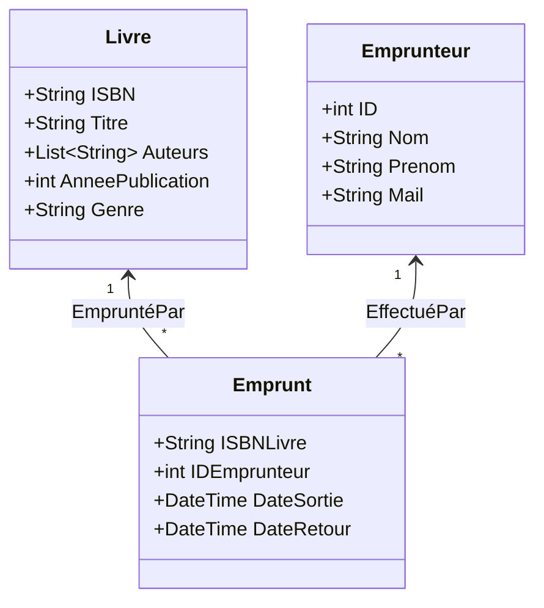
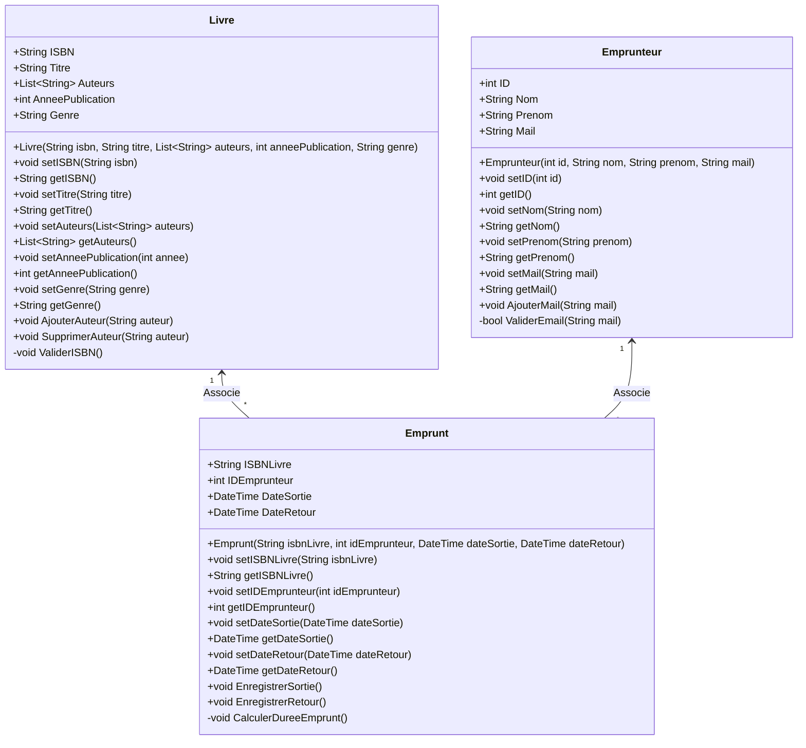

# Gestionnaire de Bibliothèque

Bienvenue dans le projet **Gestionnaire de Bibliothèque**, une application en C# permettant de gérer les livres, les emprunteurs et les emprunts d'une bibliothèque.

## Objectifs du Projet

Ce projet a pour but de :

- Apprendre les bases de la programmation en C#.
- Manipuler les concepts d’objets (classes, propriétés, méthodes).
- Travailler avec des collections comme `List<T>`.
- Implémenter la persistance des données avec JSON ou XML.
- Développer une application interactive (console ou Windows Forms).

## Fonctionnalités

1. **Gestion des Livres :**
   - Ajouter un livre (titre, auteur, année de publication, genre).
   - Supprimer un livre.
   - Afficher la liste des livres disponibles.

2. **Gestion des Emprunteurs :**
   - Ajouter un emprunteur (nom, prénom, email).
   - Supprimer un emprunteur.
   - Afficher la liste des emprunteurs.

3. **Gestion des Emprunts :**
   - Associer un emprunteur à un livre pour enregistrer un emprunt.
   - Enregistrer le retour d’un livre.
   - Afficher les emprunts en cours.

4. **Persistance des Données :**
   - Sauvegarder les livres, emprunteurs et emprunts dans un fichier JSON ou XML.
   - Charger les données au démarrage de l’application.

5. **Recherche et Filtrage :**
   - Rechercher des livres par titre, auteur ou genre.
   - Afficher les livres empruntés ou disponibles.

## **Prérequis**

Avant de commencer, assurez-vous d'avoir :

- [Visual Studio](https://visualstudio.microsoft.com/) installé.
- .NET SDK 6.0 ou une version ultérieure.

## Installation et Lancement

1. **Clonez le projet :**

   ```bash
   git clone https://github.com/votre-utilisateur/library-manager.git
   cd library-manager
   ```

2. **Ouvrez le projet :**
   - Lancez Visual Studio.
   - Ouvrez le fichier solution (`.sln`).

3. **Exécutez l’application :**
   - Appuyez sur `Ctrl+F5` pour exécuter l’application sans débogage.

## **Structure du Projet**

- **`Program.cs`** : Point d’entrée de l’application.
- **`Models/`** : Contient les classes principales comme `Livre`, `Emprunteur` et `Emprunt`.
- **`Services/`** : Fournit les fonctions de gestion (ajout, suppression, emprunts).
- **`Data/`** : Gère la lecture et l’écriture des fichiers JSON/XML.
- **`UI/`** : Implémente l’interface utilisateur (console ou graphique).

## **Améliorations Futures**

- Ajouter une interface utilisateur graphique avec WPF.
- Intégrer une base de données SQL pour la persistance.
- Ajouter des tests unitaires avec MSTest ou NUnit.

## **Contributions**

Les contributions sont les bienvenues ! Merci de suivre ces étapes :

1. Forkez le projet.
2. Créez une branche pour votre fonctionnalité :

   ```bash
   git checkout -b nouvelle-fonctionnalite
   ```

3. Soumettez une pull request.

## **License**

Ce projet est sous licence MIT. Consultez le fichier `LICENSE` pour plus d’informations.

## Driagramme UML de la data

Chaque table à un unique JSON associée. Accessible depuis [data](GestionaireBiblio/data)



## Digramme UML des classe Models


